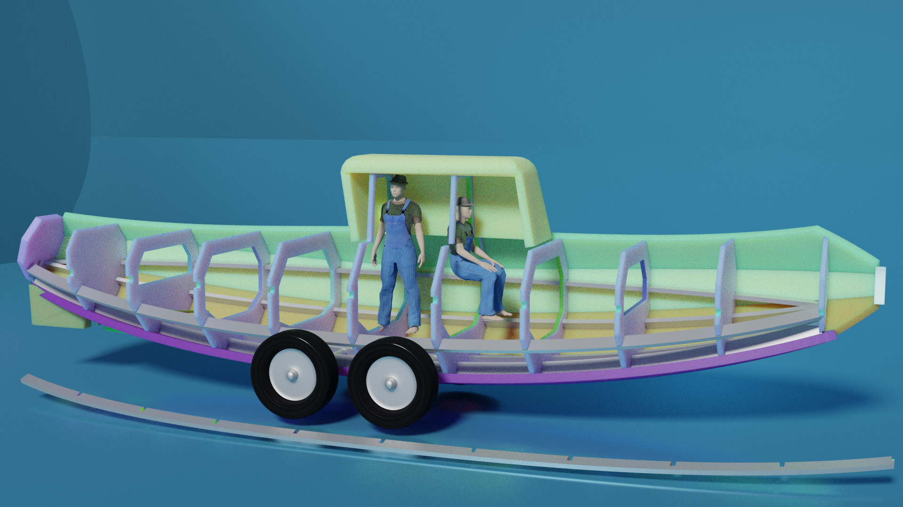
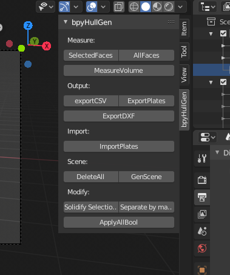
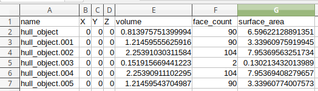
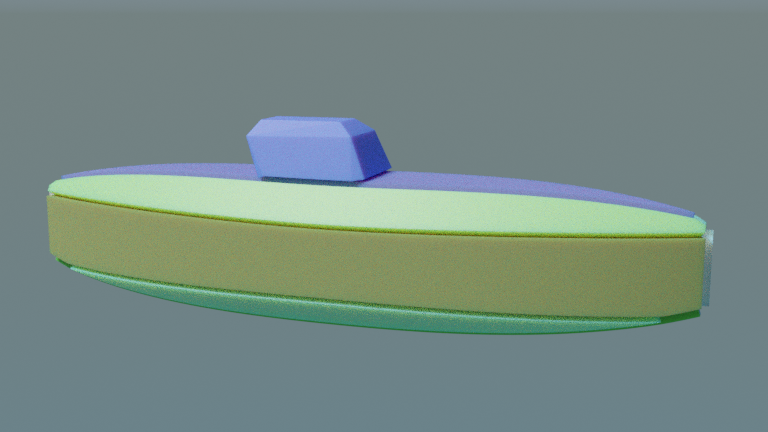
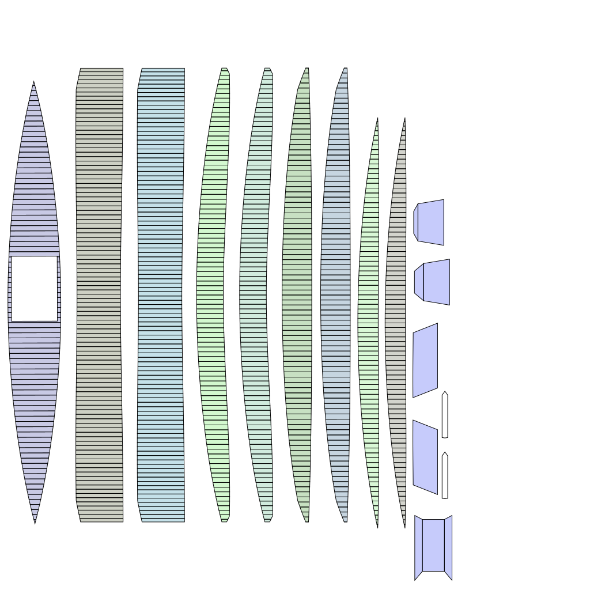
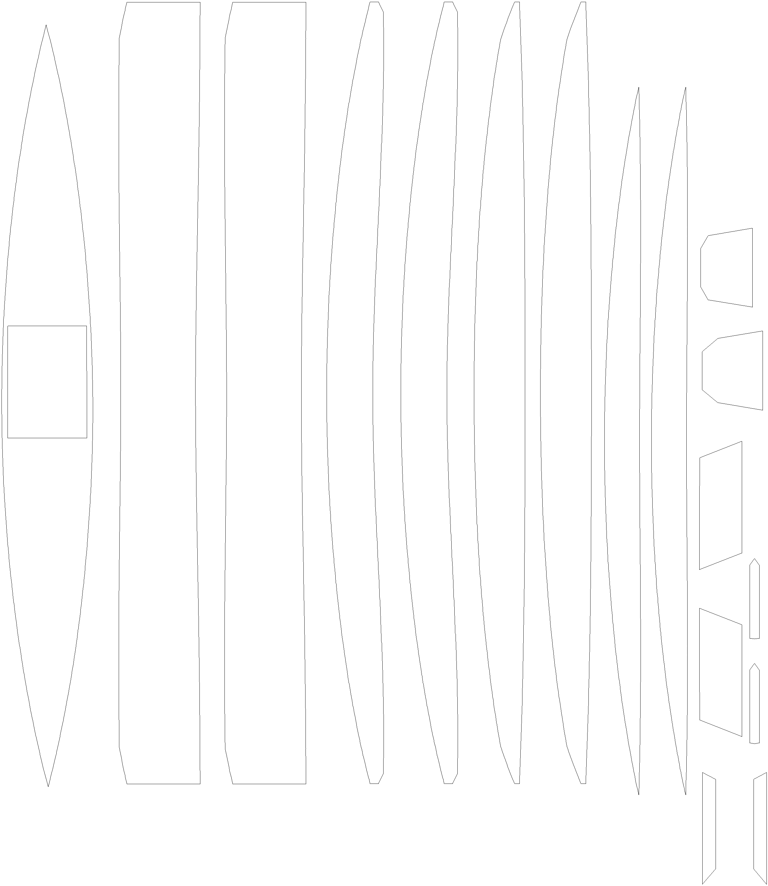
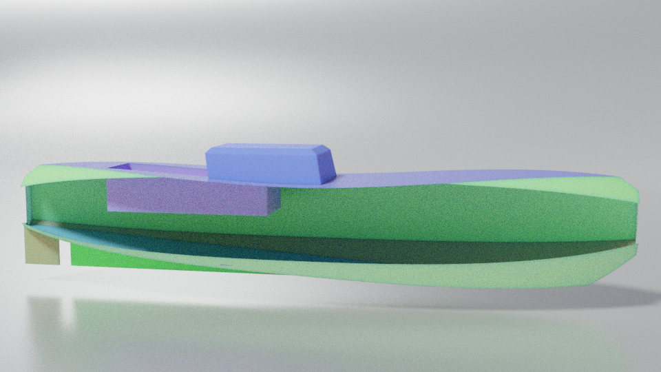
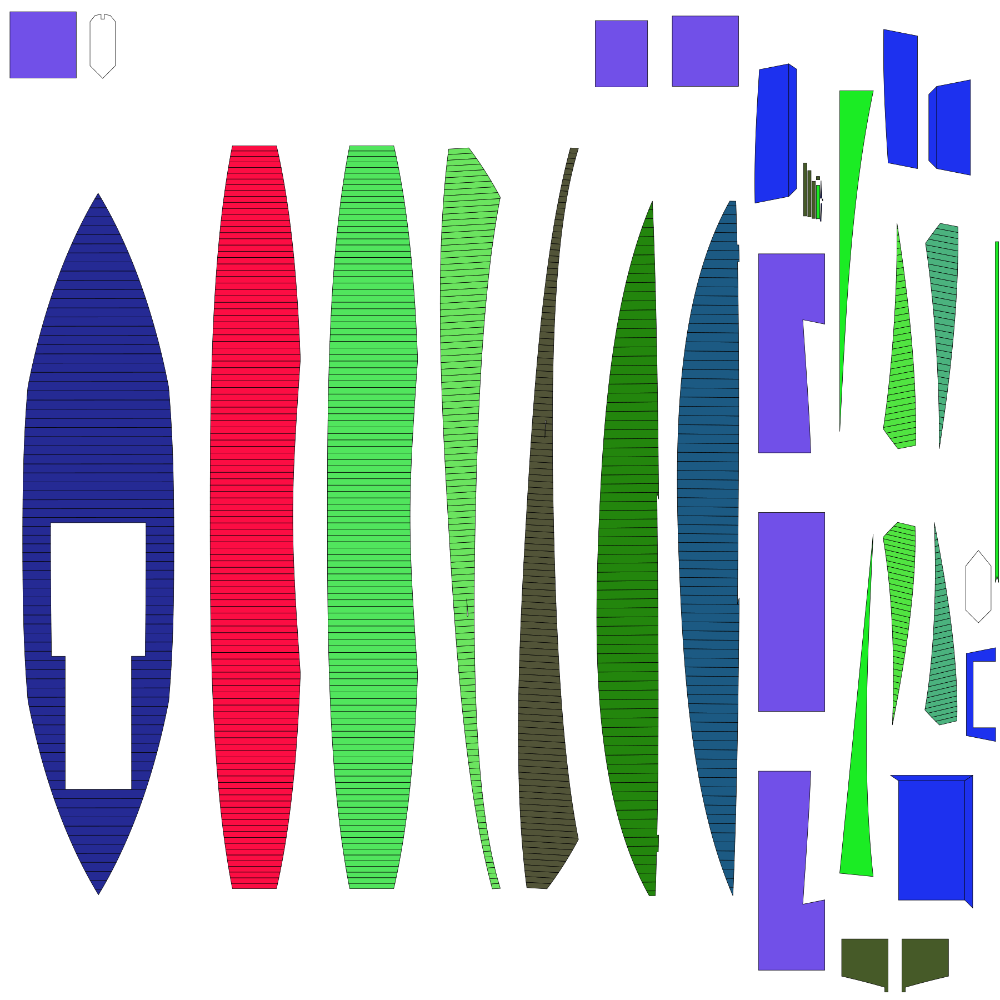
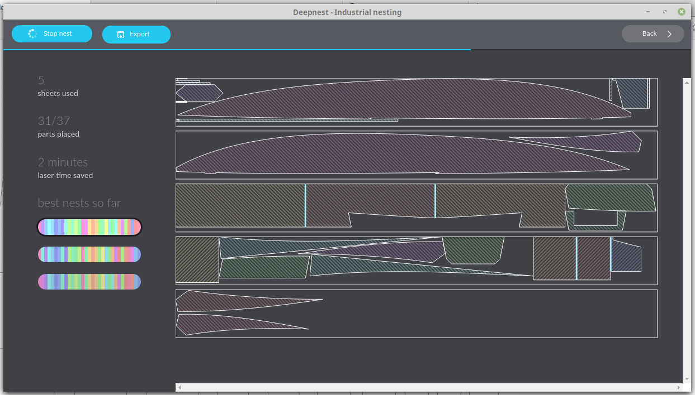
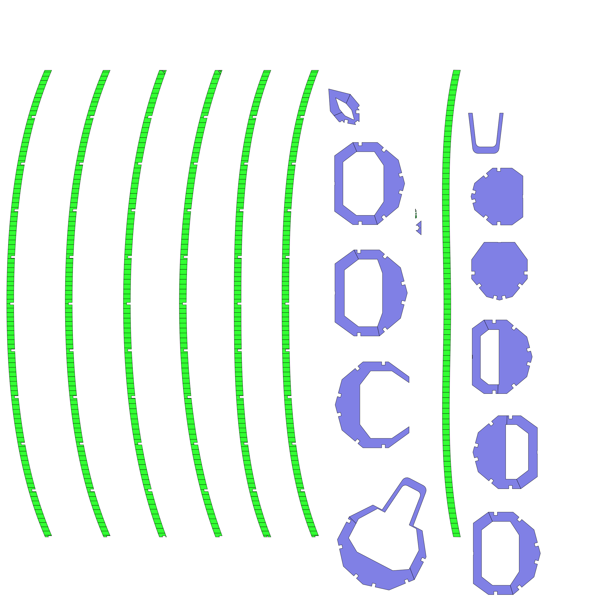

# bpyhullgen
bpyhullgen is a Blender based Parametric Hull Generator

bpyhullgen was started for the purpose of generating parametric boat hull designs that can easily converted to real world objects. 

One of the design goals of the project is to generate hulls with curves and surfaces that result in easily developable faces that can be cut from plate surfaces such as plywood, steel plate or aluminum plate and will bend and assemble together with minimal distortion and manipulation. 


## Requirements
- bpyhullgen uses [Blender](https://www.blender.org/) (version 2.8 or later) to generate the mesh geometry.

Under the hood bpyhullgen uses [Blender Python API](https://docs.blender.org/api/current/index.html) 

Blender is usually bundled with it's own version of python so no additional dependencies are needed. At the time of this writing blender was bundled with Python 3.7

bpyhullgen has been tested on Linux. I have not tried it on other platforms yet. 

## Examples


Example hull generated with bulkheads following parametric curves.


Example bulkheads with minimum floor height defined to allow for a level floor surface between bulkheads.


Bulkheads with minimum floor height defined and hull plates separated into individual sheets.


Example hull shape with longitudal stringers added and notched automatically with bulkheds for easy integration.


Example showing bulkheads and stringers and one stringer removed to show notching in both bulkhead and stringer.


## Usage
To use bpyhullgen launch blender from the command line with the `-P` command line option to execute a python script:

```
blender -P tests/hull_test_7.py
```

In the tests directory there are several unit test scripts that you can look at or modify.

There is a `render_tests.sh` script that will run and render all the unit tests in the tests directory and produce a series of .png image files in the `tests/output` directory. 

If you are able to generate these output images it's probally working correctly.

## Exporting
Once a hull shape is defined you can [Export a DXF file](EXPORTING.md) for CAD / CAM cutting. A simple UI with some features to manipulate and export the hull model for production has been provided for testing and experimenting.   


## Status
The export workflow is is work in progress and there is not a single button to do everything so it's split into separate steps to make further development and debugging easier. 

#### ApplyAllBool 
This function will apply all boolean modifers and assign a unique (name hash based) color to each face based on which boolean object was used for the boolean modifier (chine panel). This step is necessary before exporting. Having different colors assigned to each chine panel is useful for separating the panels after the boolean modifier is applied and also visualizing which panels are contiguous.

#### Separate by material
After the ApplyAllBool function is performed Separate by Material function will split the hull into separate panels based on the colors assigned during the apply all bool step.

#### ExportPlates
If you select all the plates and use this function it will export a SVG file showing all the individual plates separated with crease lines. You must first ApplyAllBool and SeparateByMaterial before you use this function or it may fail.

#### ImportPlates
This function imports the previously exported SVG file as a set of curves then removes all the crease lines and converts to a mesh.

#### ExportDXF
This function exports a set of plates to DXF for CAD/CAM cutting. You must first do the previous steps (up to ImportPlates) before doing this step. 


#### GenScene
This function is used to add a generic curved backdrop to the scene for rendering and visualization purposes. 

#### DeleteAll 
This function deletes all the mesh objects but leaves lights, empties and camera. It was used during the development process and remains for convenience and debugging.

#### Solidify Selections
This assigns a solidify modifer to each selected panel for visualization and rendering purposes. The current thickness is 0.1 but should be adjustable in the future. For now if you want a different thickness you can modify the code.

#### exportCSV
This function will export a hull_export.csv file showing the area and volume of each face for calculating material weight and cost.



You can use a spreadsheet program to calculate total weight based on the chosen material. The numbers displayed are cubic meters (m3).

## Example 7 exported (hull test 7)


Quick Hull sample model from included tests directory



Plate file SVG showing bend creases



Preview of DXF file output for CAD/CAM cutting

[Exported DXF file](images/2019_11_20_export/export.dxf) 

## Example 11_2 exported (hull test 11_2)


rendered example


plates exported 

 
Plates nested with [deepnest](https://deepnest.io/)

## 06 Dec 2019 update
Added plate normal isolation functions to cleanup bulkheads and stringers for export. 

The DeleteNonUp button should be used for selected stringers and DeleteNonFront button for selected bulkheads (selected objects only).

This function can be automated more in future so buth functions are called on objects addressed by name but for now these new buttons unit test the functionality.


## Todo
More documentation on how to use the python classes and more examples on what parameters tweak what. 
