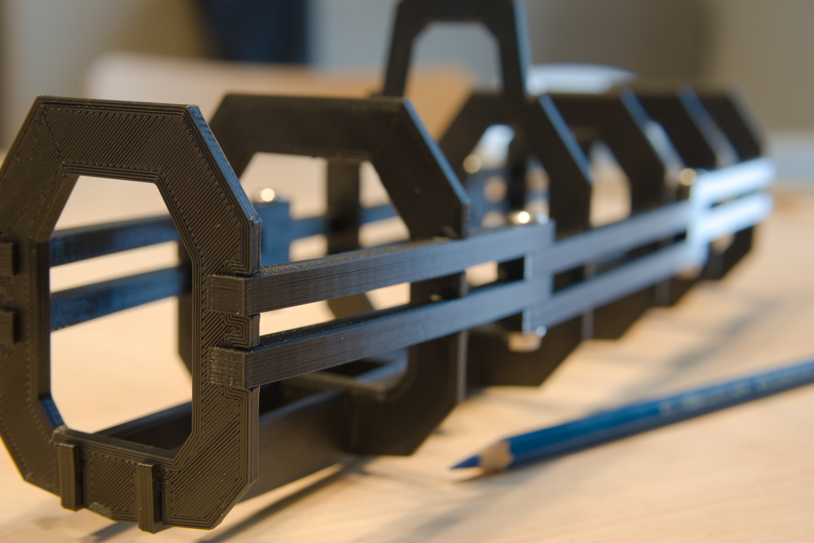
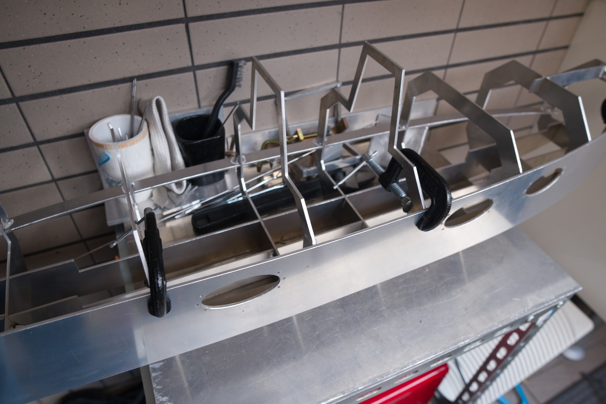
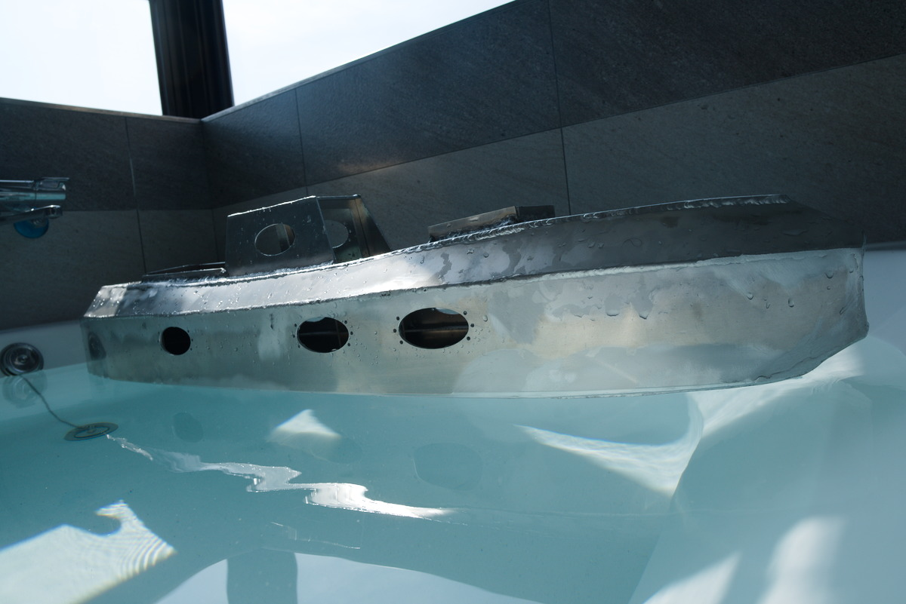

# bpyhullgen
bpyhullgen is a Blender based Parametric Hull Generator

**bpyhullgen has been updated for blender 2.92**

The WIKI has been updated to reflect new projects generated with bpyhullgen.

~~Versions of blender prior to 2.91 have a bug with boolean modifier - coplanar overlapping faces would cause irratic results.~~ 

~~[New Boolean](https://blenderartists.org/t/new-boolean/1245336) implementation fixed this problem and will be part of blender 2.91 - not yet released as of today (Oct 7th 2020)~~

~~bpyhullgen has just undergone a major refactor to use the newboolean modifier that will be released with 2.91.~~

bpyhullgen was started for the purpose of generating parametric boat hull designs that can easily converted to real world objects. 

One of the design goals of the project is to generate hulls with curves and surfaces that result in easily developable faces that can be cut from plate surfaces such as plywood, steel plate or aluminum plate and will bend and assemble together with minimal distortion and manipulation. 

## Documentation
For further information please refer to [bpyhullgen Github Wiki](https://github.com/edzop/bpyhullgen/wiki)

Example showing bulkheads and stringers and one stringer removed to show notching in both bulkhead and stringer.

See related project: [bpyhullsim](https://github.com/edzop/bpyhullsim)

