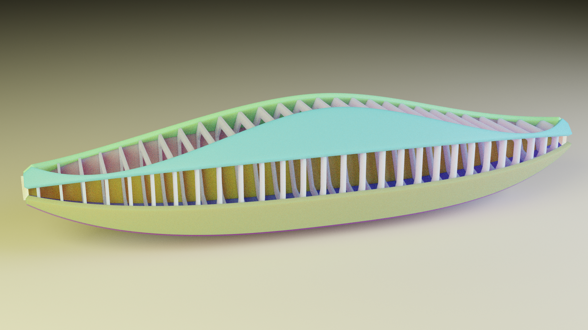
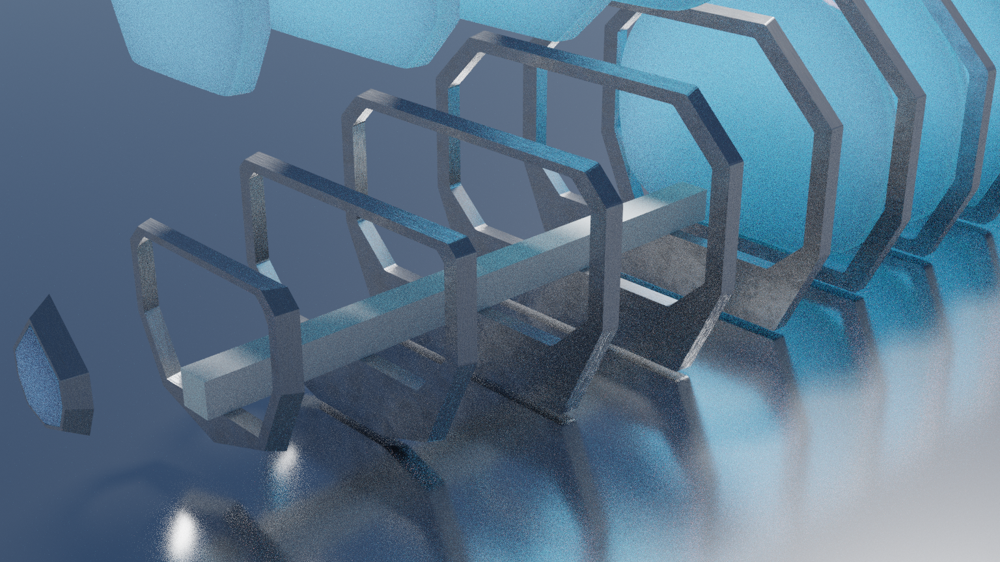
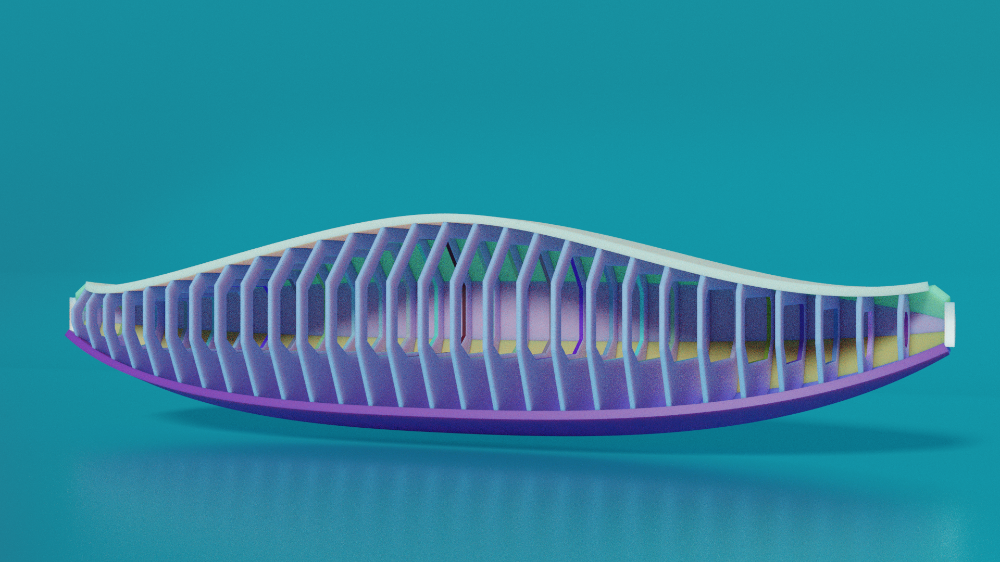
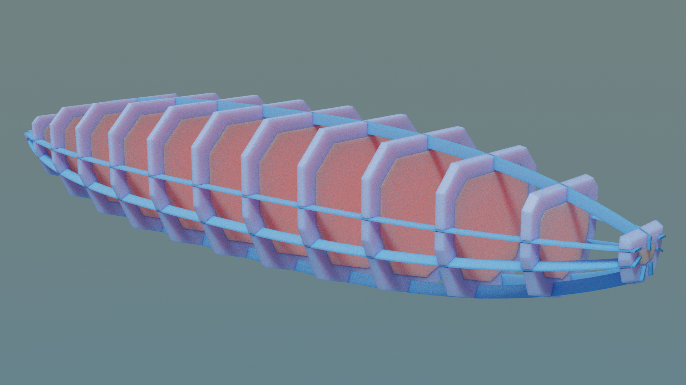

# bpyhullgen
bpyhullgen is a Blender based Parametric Hull Generator

bpyhullgen was started for the purpose of generating parametric boat hull designs that can easily converted to real world objects. 

One of the design goals of the project is to generate hulls with curves and surfaces that result in easily developable faces that can be cut from plate surfaces such as plywood, steel plate or aluminum plate and will bend and assemble together with minimal distortion and manipulation. 


## Requirements
- bpyhullgen uses [Blender](https://www.blender.org/) (version 2.8 or later) to generate the mesh geometry.

Under the hood bpyhullgen uses [Blender Python API](https://docs.blender.org/api/current/index.html) 

Blender is usually bundled with it's own version of python so no additional dependencies are needed. At the time of this writing blender was bundled with Python 3.7

bpyhullgen has been tested on Linux. I have not tried it on other platforms yet. 

## Examples


Example hull generated with bulkheads following parametric curves.


Example bulkheads with minimum floor height defined to allow for a level floor surface between bulkheads.


Bulkheads with minimum floor height defined and hull plates separated into individual sheets.


Example hull shape with longitudal stringers added and notched automatically with bulkheds for easy integration.


## Usage
To use bpyhullgen launch blender from the command line with the `-P` command line option to execute a python script:

```
blender -P tests/hull_test_7.py
```

In the tests directory there are several unit test scripts that you can look at or modify.

There is a `render_tests.sh` script that will run and render all the unit tests in the tests directory and produce a series of .png image files in the `tests/output` directory. 

If you are able to generate these output images it's probally working correctly.

## Todo
More documentation on how to use the python classes and more examples on what parameters tweak what. 
